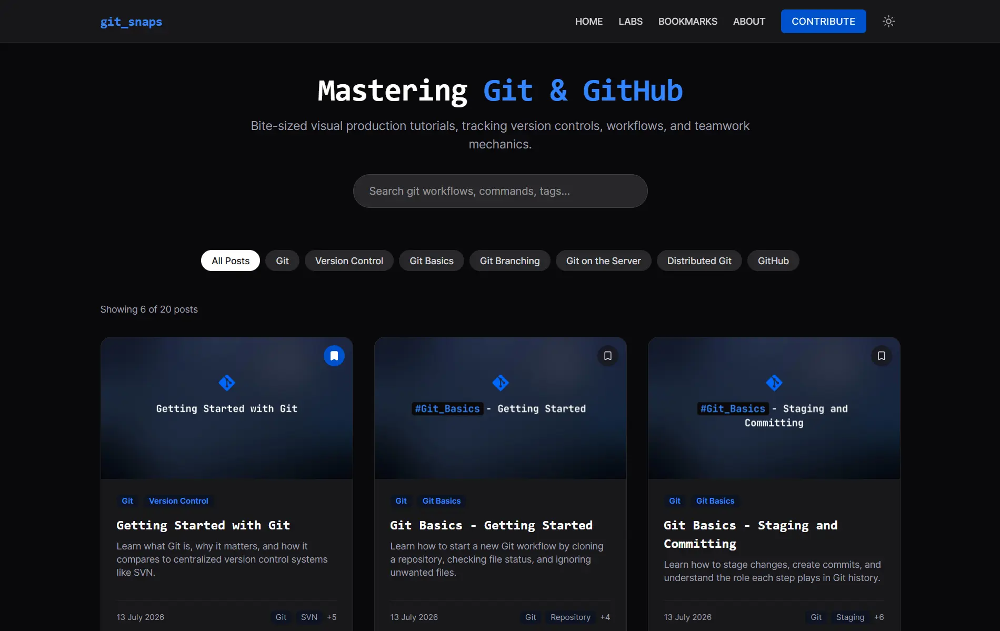

# Git Snaps 📚

A modern, interactive platform for learning Git through hands-on tutorials and labs. Built with React, Vite, and Tailwind CSS, Git Snaps transforms static documentation into dynamic, visual learning experiences.



<p align="center">
  <a href="https://reactjs.org/"></a>
  <a href="https://vitejs.dev/"></a>
  <a href="https://tailwindcss.com/"></a>
  <a href="https://reactrouter.com/"></a>
  <a href="https://git-snaps.rahafebx.workers.dev/"></a>
</p>


## 🎯 Mission

Version control systems often trip up developers early on. Git Snaps is engineered to deliver highly visual, front-end compiled tutorials directly from markdown documents, breaking down complex Git concepts like branch configurations, remote tracking, and merge conflict resolutions into digestible, hands-on lessons.

## ✨ Features

- **📖 Comprehensive Git Tutorials**: In-depth blog posts covering Git fundamentals, branching strategies, remote repositories, and advanced workflows
- **🛠️ Hands-On Labs**: Practical exercises paired with tutorials to reinforce learning through practice
- **🎨 Dynamic Markdown Rendering**: Vite's raw dynamic module imports compile markdown directly into interactive client views
- **📱 Fully Responsive Design**: Optimized for all devices with a modern, accessible UI
- **🌙 Dark Mode Support**: Integrated theme switching with Tailwind CSS custom properties
- **⚡ Lightning-Fast Search**: Client-side full-text search powered by FlexSearch, delivering instant results without server calls
- **📊 Interactive Diagrams**: Built-in Mermaid support for visualizing Git workflows and concepts
- **🎯 Code Highlighting**: Syntax-highlighted code examples using React Syntax Highlighter
- **🔗 Seamless Navigation**: React Router-based SPA with smooth transitions
- **⚙️ Static Site Generation**: Built with Vite for optimal performance and fast load times
- **🔖 Bookmarking**: Save your progress and revisit tutorials or labs with a simple click

## 🏗️ Technical Architecture

### Core Stack
- **React 19**: Modern UI framework with hooks and latest features
- **Vite 8**: Lightning-fast build tool with HMR for development
- **Tailwind CSS 4**: Utility-first CSS framework with custom theme properties
- **React Router 7**: Client-side routing for seamless navigation
- **Cloudflare Workers**: Serverless deployment with Wrangler

### Rendering & Content
- **React Markdown**: Convert markdown files into React components
- **Mermaid 11**: Diagram generation for Git workflow visualizations
- **React Syntax Highlighter**: Beautiful code syntax highlighting
- **Remark GFM**: GitHub Flavored Markdown support

### Performance
- **100% Static Compilation**: All routes pre-compiled for instant navigation
- **< 100ms Route Transitions**: Optimized for snappy user experience
- **Responsive Images**: Optimized image handling for posts and thumbnails

## 📂 Project Structure

```
git-snaps/
├── src/
│   ├── components/          # Reusable React components
│   ├── pages/               # Page components (Home, PostDetail, Labs, etc.)
│   ├── context/             # React Context for state management
│   ├── hooks/               # Custom React hooks
│   ├── utils/               # Utility functions
│   ├── App.jsx              # Main app component
│   ├── main.jsx             # Entry point
│   └── index.css            # Global styles
├── public/
│   ├── markdown/
│   │   ├── posts/           # Blog post markdown files
│   │   └── labs/            # Lab markdown files
│   └── images/
│   │   └── posts/           # Post thumbnail images
|   │   |── labs/            # Lab images
│   └── README.md            # Posts and Labs tables   
|   └── data/
|       └── blogMetadata.js  # Metadata for blog posts and labs
├── eslint.config.js         # ESLint configuration
├── vite.config.js           # Vite build configuration
├── wrangler.jsonc           # Cloudflare Workers configuration
└── package.json             # Project dependencies
```

## 🚀 Getting Started

### Prerequisites
- Node.js 18+ 
- npm or yarn

### Installation

1. **Clone the repository**
   ```bash
   git clone https://github.com/rahafebx/git-snaps.git
   cd git-snaps
   ```

2. **Install dependencies**
   ```bash
   npm install
   ```

3. **Start the development server**
   ```bash
   npm run dev
   ```
   Open [http://localhost:5173](http://localhost:5173) in your browser

### Available Scripts

- `npm run dev` - Start Vite development server with hot reload
- `npm run build` - Build optimized production bundle
- `npm run lint` - Run ESLint to check code quality
- `npm run preview` - Build and preview locally before deployment
- `npm run deploy` - Build and deploy to Cloudflare Workers

## 📝 Content Structure

### Blog Posts
Posts are located in `public/markdown/posts/` and referenced in `public/data/blogMetadata.js`. Each post includes:
- Markdown content with GFM support
- Thumbnail images
- Metadata (title, slug, category, tags, author, date)
- Related labs

### Labs
Hands-on exercises are in `public/markdown/labs/` with metadata defined alongside posts. Each lab includes:
- Step-by-step instructions
- Code examples
- Practice exercises
- Reference to parent blog post

## 🎨 Customization

### Theme Configuration
Tailwind CSS v4 properties are processed through custom variant selectors in the `src/index.css`. Modify theme colors and styles directly through Tailwind configuration or CSS custom properties.

### Adding New Content

**Adding a Blog Post:**
1. Create markdown file in `public/markdown/posts/`
2. Add metadata entry in `public/data/blogMetadata.js`
3. Add thumbnail image to `public/images/posts/`
4. Update `public/markdown/README.md` with new post details

**Adding a Lab:**
1. Create markdown file in `public/markdown/labs/`
2. Link in metadata under parent post's `labs` array
3. Update `public/markdown/README.md` with new lab details

## 🔍 Key Components

- **PostDetail.jsx** - Renders individual blog posts with table of contents
- **LabDetails.jsx** - Displays lab content with navigation
- **MarkdownContent.jsx** - Dynamic markdown rendering with syntax highlighting
- **FloatingTOC.jsx** - Auto-generated table of contents from headings
- **CategoryFilter.jsx** - Filter posts by category
- **MermaidDiagram.jsx** - Render diagram blocks in markdown

## 📜 License

This project is licensed under the **Creative Commons Attribution-NonCommercial-ShareAlike 4.0 International License**, the same terms as the original Pro Git book by Scott Chacon and Ben Straub.

[Creative Commons License](http://creativecommons.org/licenses/by-nc-sa/4.0/)

## 👏 Acknowledgments

- **Scott Chacon** and **Ben Straub** for the outstanding Pro Git book
- **The Git community** for building and maintaining this powerful tool
- Contributors and learners who make this project better

## 💬 Support & Feedback

Have questions or suggestions? We'd love to hear from you:
- [Open an issue](https://github.com/rahafebx/git-snaps/issues) for bugs and feature requests
- [Start a discussion](https://github.com/rahafebx/git-snaps/discussions) for broader conversations

---

## 💡 Need Custom Modifications?
**If you love this project and want a tailored solution, a custom WordPress theme, or a full-stack application built for your business, feel free to [Hire Me via my Portfolio](https://rahafebx.me)**.

---

**Happy learning! Master Git, one snap at a time! 🚀**
