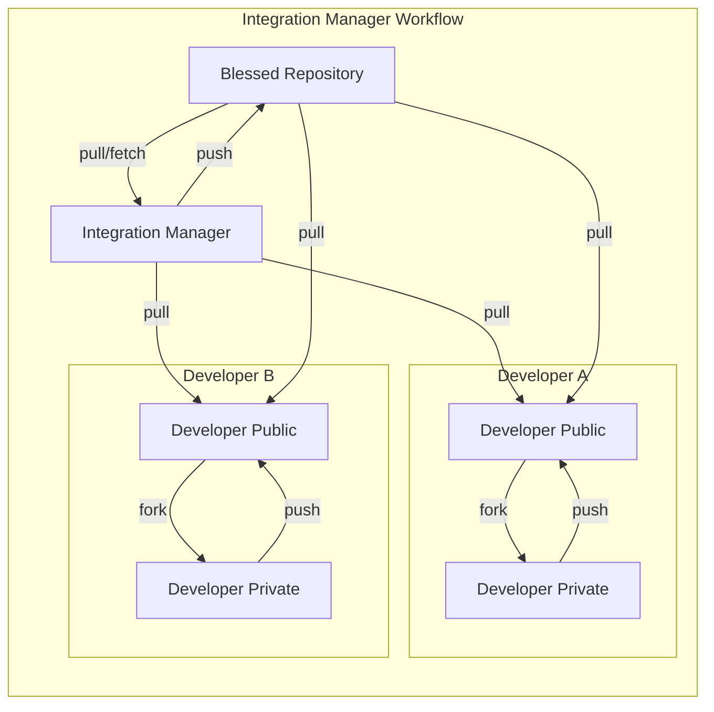
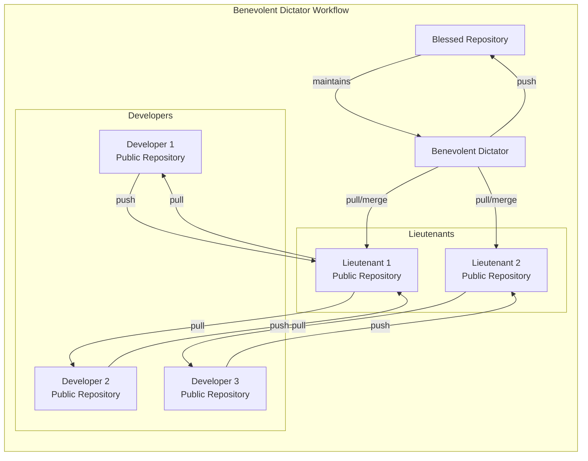

# Distributed Git

Git's distributed nature allows for a variety of workflows, each with its own advantages and disadvantages. In this guide, you will explore some of the most common workflows used in distributed Git development.

Table of Contents:
- [Distributed Git](#distributed-git)
  - [Distributed Workflows](#distributed-workflows)
    - [Centralized Workflow](#centralized-workflow)
    - [Integration-Manager Workflow](#integration-manager-workflow)
    - [Dictator and Lieutenants Workflow](#dictator-and-lieutenants-workflow)
  - [Other Learning Resources](#other-learning-resources)

## Distributed Workflows
In centralized version control systems, there is a single central repository that all developers push and pull from. In contrast, distributed version control systems like Git allow each developer to have their own local repository, which can be synchronized with others.

### Centralized Workflow
In a centralized workflow, there is a single central hub ,or repository, that all developers push and pull from.

If two developers clone from the same repository and both make changes, the first developer to push their changes will succeed, while the second developer must merge in the first developer's changes before they can push their own changes. This can lead to conflicts that must be resolved before the second developer can successfully push their changes.

### Integration-Manager Workflow
In an integration-manager workflow, there are multiple repositories, each managed by a different developer. Each developer has write access to their own public repository and read access to everyone else’s.

This workflow often includes a canonical "official" repository.

To contribute to the project, a developer creates a public clone of the official repository, makes changes in their own repository, and sends a request to the maintainer of the official repository to pull in their changes. 

The maintainer can then add the developer's repository as a remote, test developer's changes locally, and merge them into the official repository.

The process works as follows:
1. The project maintainer pushes to their public repository.
2. A contributor clones that repository and makes changes.
3. The contributor pushes to their own public copy.
4. The contributor sends the maintainer an email asking them to pull changes
5. The maintainer adds the contributor’s repository as a remote and merges locally.
6. The maintainer pushes merged changes to the main repository

This is a common workflow with hub-based tools like GitHub, GitLab, and Bitbucket. One of the main advantages of this approach is that you can continue to work, and the maintainer can pull in your changes at any time. Contributors don't have to wait for the project to incorporate their changes.

### Dictator and Lieutenants Workflow
This is a variant of multiple-repository workflow, used in large projects with many developers and lieutenants. Developers are responsible for their own public repositories. Various lieutenants are responsible for different parts of the project, and they have write access to their own repositories. The dictator has write access to the official repository and is responsible for merging changes from the lieutenants.

The process works as follows:
1. Regular developers work on their topic branch and rebase their work on top of `main`. The `main` branch is that of the reference repository to which the dictator pushes.
2. Lieutenants merge the developers' topic branches into their `main` branch.
3. The dictator merges the lieutenants' `main` branches into the dictator's `main` branch.
4. Finally, the dictator pushes that `main` branch to the reference repository so the other developers can rebase on it.

This kind of workflow isn't common, but can be useful in very big projects, or in highly hierarchical environments.  It allows the project leader (the dictator) to delegate much of the work and collect large subsets of code at multiple points before integrating them.

## Other Learning Resources
- [Patterns for Managing Source Code Branches](https://martinfowler.com/articles/branching-patterns.html)