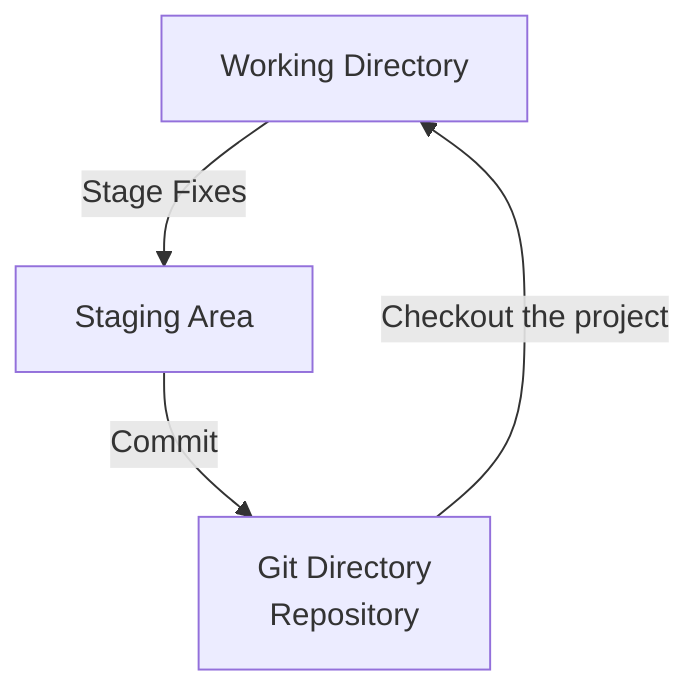

# Getting Started with Git

This guide will help you get started with Git, a distributed version control system. It covers the basics of version control, the differences between centralized and distributed systems, and how to install and configure Git on your machine.

**Table of Contents:**
- [Getting Started with Git](#getting-started-with-git)
  - [What is Version Control?](#what-is-version-control)
  - [Centralized vs Distributed Version Control](#centralized-vs-distributed-version-control)
  - [What is Git?](#what-is-git)
    - [Git Snapshot Model](#git-snapshot-model)
    - [Git Checksums](#git-checksums)
    - [Git States](#git-states)
  - [Installing Git](#installing-git)
    - [Git Version and Update](#git-version-and-update)
  - [First-Time Configuration](#first-time-configuration)
  - [Getting Help](#getting-help)
  - [Learning Resources](#learning-resources)
  - [References](#references)


## What is Version Control?

Version control is a system that records changes to a file or set of files over time so that you can recall specific versions later. It allows multiple people to work on a project simultaneously, tracks changes, and helps manage conflicts.

## Centralized vs Distributed Version Control

- **Centralized Version Control**: A single server contains all the versioned files, and clients check out files from that central place. Examples include *Subversion (SVN)* and *Concurrent Versions System (CVS)*.
- **Distributed Version Control**: Every contributor has a full copy of the repository, including its history. This allows for more flexible workflows and offline work. Examples include *Git*, *Mercurial* and *Darcs*.

## What is Git?

Git is a distributed version control system that allows multiple developers to work on a project simultaneously. It tracks changes in source code during software development and enables collaboration among team members.

### Git Snapshot Model

Git uses a snapshot model to track changes. Instead of storing differences between file versions, Git takes a snapshot of the entire project at each commit. If files have not changed, Git simply links to the previous identical file in the snapshot.

### Git Checksums

Git uses SHA-1 hashes to uniquely identify each file and directory in the repository. These checksums ensure the integrity of the data and help Git detect any changes or corruption in the files.

> Git stores everything in its database not by file name but by the hash value of its contents.

### Git States

Git tracks the state of files in three main areas:
1. **Working Directory**: The files you are currently working on (modified).
2. **Staging Area (Index)**: A place where you can prepare changes before committing them to the repository (staged).
3. **Repository**: The database where Git stores the committed snapshots of your project (committed).




## Installing Git

To install Git, follow the instructions for your operating system:
- **Windows**: Download the Git installer from [git-scm.com](https://git-scm.com/download/win) and follow the installation prompts.
- **macOS**: Use Homebrew to install Git by running `brew install git` in the terminal.
- **Linux**: Use your distribution's package manager. For example, on Ubuntu, run `sudo apt-get install git`, on Fedora, run `sudo dnf install git`.

### Git Version and Update
To check the installed Git version, run:

```bash
git --version
```

To update git to the latest version, follow the instructions for your operating system on the [Git website](https://git-scm.com/downloads).

**Update Git for Windows:**
You can update Git for Windows using the command line with the following commands based on your current version:

```bash
# For versions 2.16.1 or newer
git update-git-for-windows

# For older versions (2.14.2 to 2.16.1)
git update

# Type y and press Enter when prompted to download the package.
# Follow the setup wizard that pops up automatically to finalize the installation.
```

**Update Git for macOs:**
You can update Git on macOS using Homebrew with the following commands:

```bash
brew update
brew upgrade git
```

**Update Git for Linux:**
You can update Git on Linux using your package manager. For example, on Ubuntu, you can run:

```bash
sudo apt-get update
sudo apt-get install git
```

## First-Time Configuration

After installing Git, you need to configure your user name and email address. This information will be associated with your commits.

```bash
git config --global user.name "Your Name"
git config --global user.email "your.email@example.com"
```
Set main branch name to `main`:

```bash
git config --global init.defaultBranch main
```

Set default text editor for Git:

```bash
git config --global core.editor "your-editor"
```

View all your Git configuration settings with:

```bash
git config --list
```

Check a specific configuration setting with:

```bash
git config user.name
```

## Getting Help

There are several ways to get help with Git commands:
- Use the `--help` option with any Git command, e.g., `git commit --help`.
- Use the `git help <command>` command, e.g., `git help commit`.

For example, to get help on the `git commit` command, you can run:

```bash
git commit --help
```

Get quick help for a command with `-h` option, e.g., `git commit -h`.

## Learning Resources
- [What is version control?](https://www.atlassian.com/git/tutorials/what-is-version-control)
- [git config | Atlassian Git Tutorial](https://www.atlassian.com/git/tutorials/setting-up-a-repository/git-config)
## References
- [About Version Control](https://git-scm.com/book/en/v2/Getting-Started-About-Version-Control)
- [A Short History of Git](https://git-scm.com/book/en/v2/Getting-Started-A-Short-History-of-Git)
- [What is Git?](https://git-scm.com/book/en/v2/Getting-Started-What-is-Git%3F)
- [The Command Line](https://git-scm.com/book/en/v2/Getting-Started-The-Command-Line)
- [Installing Git](https://git-scm.com/book/en/v2/Getting-Started-Installing-Git)
- [First-Time Git Setup](https://git-scm.com/book/en/v2/Getting-Started-First-Time-Git-Setup)
- [Getting Help](https://git-scm.com/book/en/v2/Getting-Started-Getting-Help)