# Git Branching

Branching is a powerful feature that allows developers to work on different features or fixes in isolation, without affecting the main codebase.

**Table of Contents:**
- [Git Branching](#git-branching)
  - [Branches in a Nutshell](#branches-in-a-nutshell)
  - [Visualizing Git Objects](#visualizing-git-objects)
    - [Creating Branches](#creating-branches)
    - [Switching Branches](#switching-branches)
  - [Basic Branching and Merging](#basic-branching-and-merging)
    - [Basic Merge Conflicts](#basic-merge-conflicts)


## Branches in a Nutshell

**Git stores its data in a simple way:** as a series of snapshots of a miniature filesystem. Every time you commit, or save the state of your project, Git takes a picture of what all your files look like at that moment and stores a reference to that snapshot.

Git stores these snapshots in a data structure called a **commit**. Each commit has a unique ID (a SHA-1 hash) and contains metadata about the commit, such as the author, date, a message describing the changes, and a pointer to the parent(s) commit—zero parents for the initial commit, one parent for a regular commit, and multiple parents for a merge commit.

## Visualizing Git Objects

Let’s visualize a simple Git repository with a few commits. Imagine we have a project with three files: `index.html`, `style.css`, and `app.js`. You stage them  all and commit. Staging the files computes a checksum for each file and stores a snapshot of the content in the Git database.

```bash
git add index.html style.css app.js
git commit -m "Initial commit"
```

**The Git repository now contains five objects:** three blobs (one for each file), one tree (representing the project directory), and one commit object. The commit object points to the tree, which in turn points to the blobs.

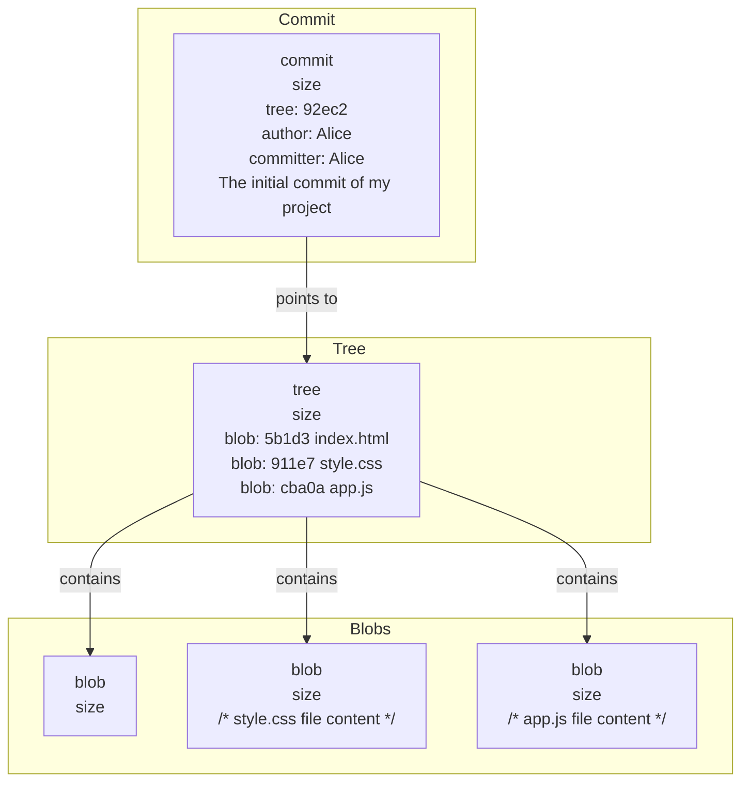

> If you make some changes and commit again, the next commit stores a pointer to the commit that came immediately before it.

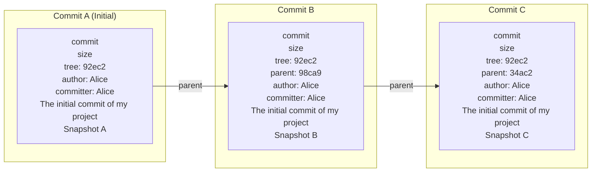
A branch in Git is simply a lightweight movable pointer to one of these commits. The default branch name in Git is `master` (or `main` in newer versions). As you start making commits, you're given a `master` branch that points to the last commit you made. Every time you commit, it moves forward automatically.

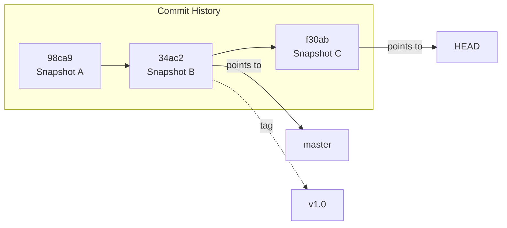

### Creating Branches
Creating a new branch will create a new pointer for you to move around. To create a new branch, you can use the `git branch` command:

```bash
git branch feature/theme-switching
```
This command creates a new pointer called `feature/theme-switching` that points to the same commit as the current branch (e.g., `master`).

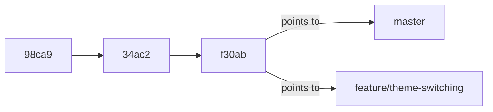

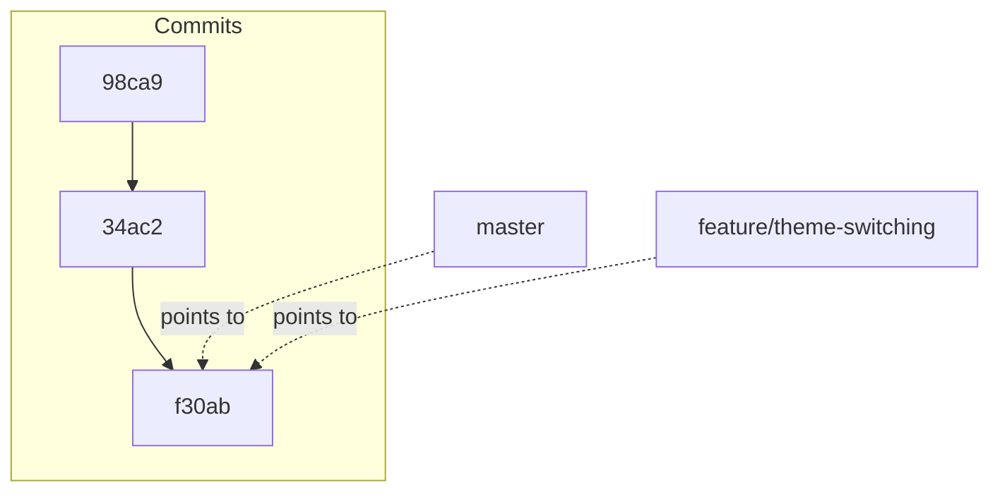

Git keeps a special pointer called `HEAD` which always points to the current branch reference, which in turn points to the last commit you made. 

You can see where the branch pointers are by using the `git log` command with the `--oneline` and `--decorate` options:

```bash
git log --oneline --decorate
```

### Switching Branches
The `git branch` command only creates the new branch pointer; it doesn’t switch to it. To switch branches, you can use the `git checkout` command:

```bash
git checkout feature/theme-switching
```
This moves `HEAD` to point to the `feature/theme-switching` branch.

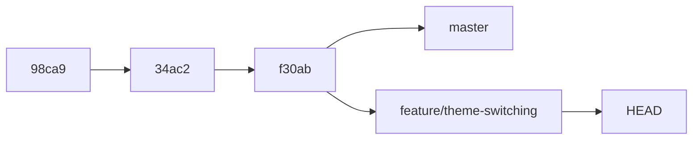

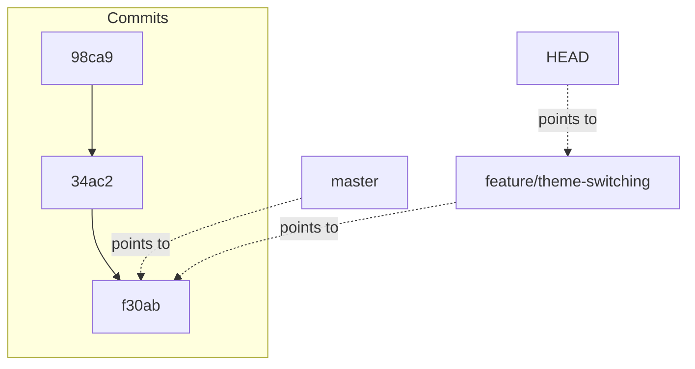
If we create a new commit while on the `feature/theme-switching` branch, the `feature/theme-switching` pointer will move forward automatically, while the `master` pointer stays where it is.

```bash
echo "body { background-color: black; }" >> style.css
git add style.css
git commit -m "Add dark mode background color"
```

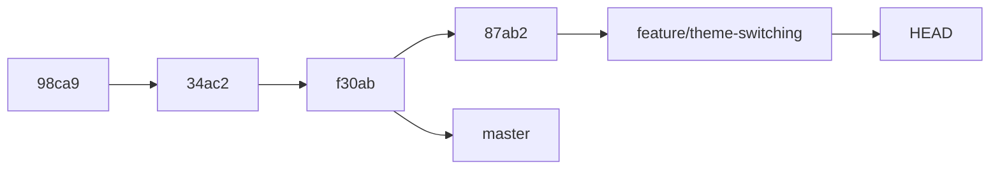

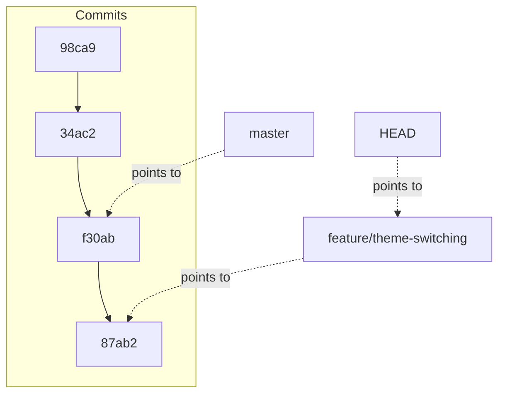

If we switch back to the `master` branch, and view the log, we can see that the `master` branch pointer is still pointing to the commit before the dark mode changes were made. However, the `feature/theme-switching` branch would not appear in the log because it is not part of the `master` branch history.

```bash
git checkout master
git log --oneline --decorate
```
The `git log` command only shows the history of the current branch. To see all branches, you can use the `--all` option:

```bash
git log --oneline --decorate --all
```
Also, the current working directory will reflect the state of the files in the commit that the current branch points to. This means that if you switch back to the `master` branch, the changes made in the `feature/theme-switching` branch will not be present in your working directory, and via versa. This is because Git updates the files in your working directory to match the snapshot of the commit that the current branch points to.

Now we are in the `master` branch, and we will make a few changes and commit them. This will move the `master` branch pointer forward, while the `feature/theme-switching` branch pointer will stay where it is.

```bash
echo "console.log('Hello, World!');" >> app.js
git add app.js
git commit -m "Add hello world message to app.js"
```

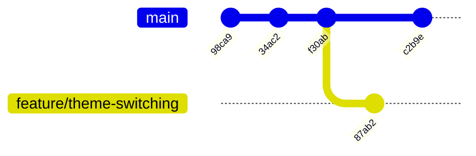

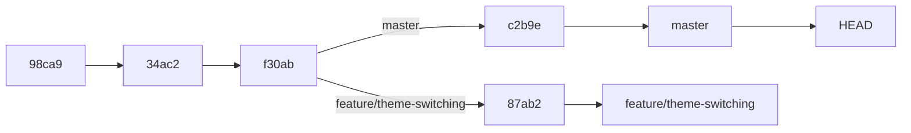

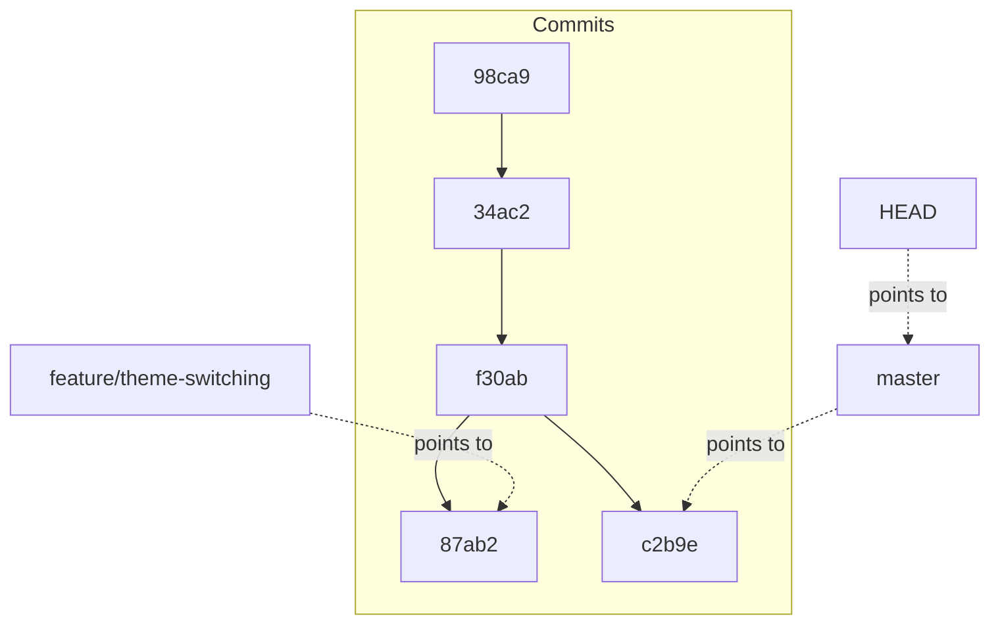
**Note:** We can create a branch and switch to it in one command using the `-c` or `--create` option:

```bash
git switch -c feature/new-feature

# Or using checkout command
git checkout -b feature/new-feature
```
`git switch` is a newer command that is more intuitive than `git checkout` for switching branches. The `-c` option creates a new branch and switches to it in one step.


## Basic Branching and Merging
Now that we have two branches, `master` and `feature/theme-switching`, we can merge the changes from the `feature/theme-switching` branch back into the `master` branch. To do this, we first need to switch back to the `master` branch:

```bash
# list all branches, the current branch will be highlighted with an asterisk
git branch
# switch to the master branch
git switch master
```
Then we can use the `git merge` command to merge the changes from the `feature/theme-switching` branch into the `master` branch:

```bash
git merge feature/theme-switching
```
After the merge, we can delete the `feature/theme-switching` branch since it is no longer needed:

```bash
git branch -d feature/theme-switching
```
The `-D` option forces the deletion of the branch, even if it has unmerged changes.

### Basic Merge Conflicts
If you make changes to the same lines of code in both branches, Git will not be able to automatically merge the changes and will mark the file as having a conflict. You will need to manually resolve the conflict by editing the file and choosing which changes to keep.

To check the status of the repository and see which files have conflicts, you can use the `git status` command:

```bash
git status
```
Anything that is marked as "both modified" has a conflict that needs to be resolved.  Git adds standard conflict-resolution markers to the files that have conflicts, so you can open them manually and resolve those conflicts.

Example of a conflict in `index.html`:

```html
<<<<<<< HEAD
<button class="btn" id="theme-toggle">Toggle Theme</button>
=======
<button class="btn" id="theme_toggle_btn">Toggle Theme</button>
>>>>>>> branch-name:index.html
```
In order to resolve the conflict, you have to either choose one side or the other or merge the contents yourself.

After resolving the conflict, you need to add the file to the staging area and commit the changes:

```bash
git add index.html
git commit -m "Resolve merge conflict in index.html"
```