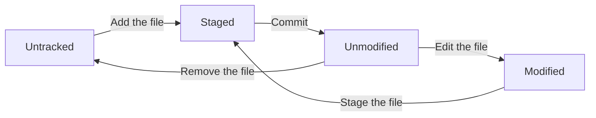

# Getting Started with Git

This guide will help you get started with Git, a distributed version control system that allows you to track changes in your code and collaborate with others.

**Table of Contents:**
- [Getting Started with Git](#getting-started-with-git)
  - [Getting a Git Repository](#getting-a-git-repository)
    - [Creating a New Repository](#creating-a-new-repository)
    - [Cloning an Existing Repository](#cloning-an-existing-repository)
  - [Recording Changes to the Repository](#recording-changes-to-the-repository)
    - [Checking the Status of Your Files](#checking-the-status-of-your-files)
    - [Tracking New Files](#tracking-new-files)
    - [Short Status](#short-status)
    - [Ignoring Files](#ignoring-files)
  - [Other Learning Resources](#other-learning-resources)


## Getting a Git Repository

To start using Git, you need to have a Git repository.

### Creating a New Repository

Navigate to the directory where you want to initialize the repository and run:

```bash
git init
```

### Cloning an Existing Repository

Use the `git clone` command followed by the repository URL:

```bash
git clone <repository-url> <directory-name>
```

`directory-name` is optional and specifies the name of the directory to clone into. If not provided, Git will create a new directory with the same name as the repository:

Example:

```bash
git clone https://github.com/rahafebx/progit-snapshot.git pro-git-learning
```

## Recording Changes to the Repository

Once you have a Git repository, you can start recording changes to it. The basic workflow involves three main steps: staging changes, committing changes, and pushing changes to a remote repository.

Each file in your working directory can be in one of two states: **tracked** or **untracked**. 
- Tracked files are those that were in the last snapshot; they can be **unmodified**, **modified**, or **staged**.
- Untracked files are everything else—any files in your working directory that were not in your last snapshot and are not in your staging area.



### Checking the Status of Your Files

The `git status` command shows you which files are tracked, untracked, modified, or staged for commit, and which branches you are on.

```bash
git status
```

### Tracking New Files

To start tracking a new file, you need to add it to the staging area using the `git add` command:

```bash
git add <file-name>
```

### Short Status

You can also use the `git status` command with the `-s` or `--short` option to get a more concise output:

```bash
git status -s
```

The output will show the status of each file in a two-letter format, where the first letter indicates the status of the staging area and the second letter indicates the status of the working directory:
- `??`: Untracked file
- `M`: Modified file
- `A`: Added file (staged for commit)
- `R`: Renamed file
- `D`: Deleted file

Example: The `AM` indicates that the file is staged for commit (A) and has been modified (M) in the working directory.

### Ignoring Files

Often, you may want to ignore certain files or directories in your repository, such as temporary files or build artifacts. You can do this by creating a `.gitignore` file in the root of your repository and specifying the patterns of files to ignore.

```gitignore
# Example .gitignore file
# Ignore all .log files (any file with a .log extension)
*.log
# Ignore the build directory
build/
# Ignore all .DS_Store files (macOS)
.DS_Store
```

A collection of useful .gitignore templates can be found at [gitignore](https://github.com/github/gitignore) by GitHub. You can also use the `git check-ignore` command to check if a specific file is being ignored:

```bash
git check-ignore <file-name>
```

The rules for `.gitignore` files are as follows:
- Blank lines are ignored.
- Lines starting with `#` are comments and are ignored.
- Standard glob patterns are used for matching file names.
- You can negate a pattern by starting it with `!`, which will include files that would otherwise be ignored.
- You can start the pattern with a `/` to match files only in the root directory of the repository.
- You can end the pattern with a `/` to match only directories.

Global patterns:
- `*` matches any number of characters, including none.
- `?` matches any single character.
- `[abc]` matches any one character in the brackets.
- `[a-z]` matches any one character in the specified range.
- `**` matches directories recursively.
- `[0-9]` matches any one digit in the specified range.
- `[a/**/z]` matches any directory that contains a `z` file or directory.

It's possible to have multiple `.gitignore` files in a repository, and they can be placed in different directories. The rules in each `.gitignore` file apply to the directory it is in and all its subdirectories.

## Other Learning Resources

- [Introduction to Git](https://learn.microsoft.com/en-us/training/modules/intro-to-git/) - Microsoft Learn