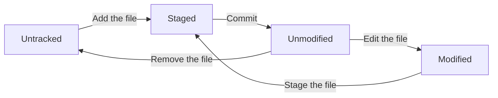

# Git Basics

The Git Basics guide covers the fundamental concepts and commands of Git. It provides an overview of how to create and manage Git repositories, track changes, collaborate with others, and maintain a history of your project.

The Table of Contents:
- [Git Basics](#git-basics)
  - [Getting a Git Repository](#getting-a-git-repository)
    - [Creating a New Repository](#creating-a-new-repository)
    - [Cloning an Existing Repository](#cloning-an-existing-repository)
  - [Recording Changes to the Repository](#recording-changes-to-the-repository)
    - [Checking the Status of Your Files](#checking-the-status-of-your-files)
    - [Tracking New Files](#tracking-new-files)
    - [Short Status](#short-status)
    - [Ignoring Files](#ignoring-files)
    - [Viewing Staged and Unstaged Changes](#viewing-staged-and-unstaged-changes)
    - [Committing Changes](#committing-changes)
    - [Skipping the Staging Area](#skipping-the-staging-area)
    - [Removing Files](#removing-files)
    - [Moving Files](#moving-files)
  - [Viewing the Commit History](#viewing-the-commit-history)
    - [Limiting the Log Output](#limiting-the-log-output)
    - [Undoing Changes](#undoing-changes)
    - [Unstaging Changes](#unstaging-changes)
    - [Unmodifying Changes](#unmodifying-changes)
    - [Undoing With `git restore`](#undoing-with-git-restore)
  - [Working with Remote Repositories](#working-with-remote-repositories)
    - [Showing Remote Repositories](#showing-remote-repositories)
    - [Adding a Remote Repository](#adding-a-remote-repository)
    - [Fetching and Pulling from Remote Repositories](#fetching-and-pulling-from-remote-repositories)
    - [Pushing Changes to Remote Repositories](#pushing-changes-to-remote-repositories)
    - [Inspecting a Remote Repository](#inspecting-a-remote-repository)
    - [Renaming and Removing Remote Repositories](#renaming-and-removing-remote-repositories)
  - [Tagging](#tagging)
    - [List Tags](#list-tags)
    - [Creating Tags](#creating-tags)
    - [Tagging Latest Commit](#tagging-latest-commit)
    - [Sharing Tags](#sharing-tags)
    - [Deleting Tags](#deleting-tags)
    - [Checking out Tags](#checking-out-tags)
  - [Git Aliases](#git-aliases)

## Getting a Git Repository
To start using Git, you need to have a Git repository.

### Creating a New Repository
Navigate to the directory where you want to initialize the repository and run:

```bash
git init
```

### Cloning an Existing Repository
Use the `git clone` command followed by the repository URL:

```bash
git clone <repository-url> <directory-name>
```

`directory-name` is optional and specifies the name of the directory to clone into. If not provided, Git will create a new directory with the same name as the repository:

Example:

```bash
git clone https://github.com/rahafebx/progit-snapshot.git pro-git-learning
```

## Recording Changes to the Repository
Once you have a Git repository, you can start recording changes to it. The basic workflow involves three main steps: staging changes, committing changes, and pushing changes to a remote repository.

Each file in your working directory can be in one of two states: **tracked** or **untracked**. 
- Tracked files are those that were in the last snapshot; they can be **unmodified**, **modified**, or **staged**.
- Untracked files are everything else—any files in your working directory that were not in your last snapshot and are not in your staging area.



### Checking the Status of Your Files
The `git status` command shows you which files are tracked, untracked, modified, or staged for commit, and which branches you are on.

```bash
git status
```
### Tracking New Files
To start tracking a new file, you need to add it to the staging area using the `git add` command:

```bash
git add <file-name>
```
### Short Status
You can also use the `git status` command with the `-s` or `--short` option to get a more concise output:

```bash
git status -s
```
The output will show the status of each file in a two-letter format, where the first letter indicates the status of the staging area and the second letter indicates the status of the working directory:
- `??`: Untracked file
- `M`: Modified file
- `A`: Added file (staged for commit)
- `R`: Renamed file
- `D`: Deleted file

Example: The `AM` indicates that the file is staged for commit (A) and has been modified (M) in the working directory.

### Ignoring Files
Often, you may want to ignore certain files or directories in your repository, such as temporary files or build artifacts. You can do this by creating a `.gitignore` file in the root of your repository and specifying the patterns of files to ignore.

```gitignore
# Example .gitignore file
# Ignore all .log files (any file with a .log extension)
*.log
# Ignore the build directory
build/
# Ignore all .DS_Store files (macOS)
.DS_Store
```

A collection of useful .gitignore templates can be found at [gitignore](https://github.com/github/gitignore) by GitHub. You can also use the `git check-ignore` command to check if a specific file is being ignored:

```bash
git check-ignore <file-name>
```

The rules for `.gitignore` files are as follows:
- Blank lines are ignored.
- Lines starting with `#` are comments and are ignored.
- Standard glob patterns are used for matching file names.
- You can negate a pattern by starting it with `!`, which will include files that would otherwise be ignored.
- You can start the pattern with a `/` to match files only in the root directory of the repository.
- You can end the pattern with a `/` to match only directories.

Global patterns:
- `*` matches any number of characters, including none.
- `?` matches any single character.
- `[abc]` matches any one character in the brackets.
- `[a-z]` matches any one character in the specified range.
- `**` matches directories recursively.
- `[0-9]` matches any one digit in the specified range.
- `[a/**/z]` matches any directory that contains a `z` file or directory.

It's possible to have multiple `.gitignore` files in a repository, and they can be placed in different directories. The rules in each `.gitignore` file apply to the directory it is in and all its subdirectories.

### Viewing Staged and Unstaged Changes
You can view the changes that have been staged for commit and the changes that are still unstaged using the `git diff` command.

```bash
git diff
```
`git diff` shows the exact lines that have been added, modified, or deleted in the files. By default, it shows the differences between the working directory and the staging area (unstaged changes). To see the differences between the staging area and the last commit (staged changes), you can use:

```bash
git diff --staged
```
You can use `git diff --cached` as an alternative to `git diff --staged`.

### Committing Changes
Once you have staged your changes, you can commit them to the repository using the `git commit` command. A commit is a snapshot of your repository at a specific point in time. Anything that still unstaged will not be included in the commit. The flag `-m` allows you to include a commit message directly in the command:

```bash
git commit -m "Your commit message here"
```
The output will show the number of files changed, the number of insertions and deletions, and the commit hash.

### Skipping the Staging Area
If you want to commit changes directly without staging them first, you can use the `-a` flag with the `git commit` command. This will automatically stage all tracked files that have been modified and commit them in one step:

```bash
git commit -am "Your commit message here"
```
### Removing Files
To remove a file from the working directory and the staging area, you can use the `git rm` command:

```bash
git rm <file-name>
```
If you modified the file or had staged it, you can use the `-f` flag to force the removal:

```bash
git rm -f <file-name>
```
To keep the file in your working directory but remove it from the staging area, you can use the `--cached` flag:

```bash
git rm --cached <file-name>
```

You can pass multiple file names to the `git rm`. You can also use wildcards to remove files that match a specific pattern.

Example: To remove all `.log` files from the repository, you can use:

```bash
git rm *.log
git rm log/\*.log
```
**Note:** the backslash `\` is used to escape the asterisk `*` in the second command, which is necessary when using wildcards in certain shells.

### Moving Files
To move or rename a file in the repository, you can use the `git mv` command. This command will move the file in your working directory and stage the change for commit:

```bash
git mv <old-file-name> <new-file-name>
```

## Viewing the Commit History
You can view the commit history of your repository using the `git log` command. This command will show you a list of commits, including the commit hash, author, date, and commit message:

```bash
git log
```
Command options:
- `--patch` or `-p`: Show the changes made in each commit.
- `-n <number>`: Limit the number of commits shown.
- `--stat`: Show a summary of changes made in each commit.
- `--pretty`: Customize the output format of the log. Available formats include `oneline`, `short`, `medium`, `full`, `fuller`, and `format:<string>`.
- `--graph`: Show a graphical representation of the commit history.
- `--shortstat`: Show a summary of changes made in each commit, similar to `--stat`, but in a more concise format.
- `--name-only`: Show only the names of the files that were changed in each commit.
- `--name-status`: Show the names of the files that were changed in each commit, along with their status (added, modified, deleted).
- `--abbrev-commit`: Show only the abbreviated commit hash in the log output.

Examples:

Show the last 5 commits with a summary of changes:
```bash
git log -n 5 --stat
```
Show the last 3 commits in a single line format:
```bash
git log -n 3 --pretty=oneline
```
Specify a custom format for the log output. This example shows the commit hash, author name, relative date, and commit message:
```bash
git log --pretty=format:"%h - %an, %ar : %s"
```
Useful specifiers for formatting the log output:
| Specifier | Description |
|-----------|-------------|
| %H        | Commit hash |
| %h        | Abbreviated commit hash |
| %T        | Tree hash |
| %t        | Abbreviated tree hash |
| %P        | Parent hashes |
| %p        | Abbreviated parent hashes |
| %an       | Author name |
| %ae       | Author email |
| %ad       | Author date (format respects the --date= option) |
| %ar       | Author date, relative |
| %cn       | Committer name |
| %ce       | Committer email |
| %cd       | Committer date |
| %cr       | Committer date, relative |
| %s        | Subject |

### Limiting the Log Output
You can limit the log output to a specific number of commits using the `-n` option followed by the number of commits you want to see. For example, to see the last 3 commits, you can use:

```bash
git log -n 3
```
Time-based filtering can also be applied to the log output using the `--since` and `--until` options. For example, to see commits made in the last 7 days, you can use:

```bash
git log --since="7 days ago"
```
You can specify:
- A specific date: `--since="2024-01-01"`
- A relative time: `--since="2 weeks ago"`

The `--author` option allows you to filter commits by a specific author. For example, to see commits made by "John Doe", you can use:

```bash
git log --author="John Doe"
```
The `--grep` option allows you to search for commits with specific keywords in the commit message. For example, to find commits that mention "bug fix", you can use:

```bash
git log --grep="bug fix"
```
The `--all-match` option can be used in conjunction with `--author` and `--grep` to find commits that match both criteria. For example, to find commits made by "John Doe" that mention "bug fix", you can use:

```bash
git log --author="John Doe" --grep="bug fix" --all-match
```
The `-S` option allows you to search for commits that add or remove a specific string in the code. For example, to find commits that add or remove the string "initialize", you can use:

```bash
git log -S "initialize"
```

You can limit the log output to a specific file or directory by specifying the path after the log command. For example, to see the commit history for a specific file named `example.txt`, you can use:

```bash
git log -- example.txt
```

Options to limit the output of `git log`:

|Option|Description|
|------|-----------|
|`-n <number>`|Limit the number of commits shown.|
|`--since=<date>`|Show commits made after the specified date.|
|`--until=<date>`|Show commits made before the specified date.|
|`--after=<date>`|Show commits made after the specified date (same as `--since`).|
|`--before=<date>`|Show commits made before the specified date (same as `--until`).|
|`--author=<pattern>`|Show commits made by the specified author.|
|`--committer=<pattern>`|Show commits made by the specified committer.|
|`--grep=<pattern>`|Show commits with messages matching the specified pattern.|
|`-S <string>`|Show commits that add or remove the specified string in the code.|

For example, if you want to see which commits modifying test files in the Git source code history were committed by John Doe in the month of November 2016 and are not merge commits, you can use the following command:

```bash
git log --pretty="%h - %s" --author="John Doe" --since="2016-11-01" --until="2016-11-30" --no-merges -- t/
```

The `--no-merges` option excludes merge commits from the log output. The `--pretty="%h - %s"` option formats the output to show only the abbreviated commit hash and the commit message.

### Undoing Changes
When you want to modify the most recent commit, you can use the `git commit --amend` command. This allows you to change the commit message or add new changes to the last commit.

```bash
git commit --amend
```

After running this command, Git will open your default text editor with the commit message of the last commit. You can edit the message by pressing `i` and save the changes by pressing `Esc` and then typing `:wq` and pressing `Enter`. If you want to add new changes to the last commit, you can stage the changes using `git add` before running `git commit --amend`.

Only amend commits that have not been pushed to a remote repository. If you have already pushed the commit, you should avoid amending it, as it can cause issues for other collaborators.

### Unstaging Changes
If you have staged changes that you want to unstage, you can use the `git reset` command. This command will move the changes from the staging area back to the working directory, allowing you to modify them further before committing.

```bash
git reset HEAD <file-name>
```
### Unmodifying Changes
If you have modified changes that you want to undo, you can use the `git checkout` command. This command will discard the changes and restore the file to its last committed state.

```bash
git checkout -- <file-name>
```
### Undoing With `git restore`
`git restore` is a command that can be used to undo changes in your working directory or staging area. It can be used to restore files to their last committed state or to unstage changes. It's a more modern alternative to `git checkout` for undoing changes.

```bash
# To restore a file to its last committed state
git restore <file-name>
```
To restore a file to its last staged state (unstage changes), you can use the `--staged` option:

```bash
# To unstage changes for a file
git restore --staged <file-name>
```

## Working with Remote Repositories
Remote repositories are versions of your project that are hosted on the internet or network somewhere. You can have multiple remote repositories for a single project, and you can push and pull changes to and from these repositories.

### Showing Remote Repositories
To see which remote repositories are configured for your local repository, you can use the `git remote -v` command. This will show you the names and URLs of the remote repositories:

```bash
git remote -v
```

### Adding a Remote Repository
To add a new remote repository, you can use the `git remote add` command followed by the name you want to give to the remote and the URL of the repository:

```bash
git remote add <remote-name> <repository-url>
```
The `git clone` command automatically adds a remote named `origin` that points to the cloned repository. You can use any name you like for the remote, but `origin` is the conventional name for the main remote repository.

Example:

```bash
git remote add pb https://github.com/rahafebx/progit-snapshot.git

# use added remote name to fetch changes from the remote repository
git fetch pb
```
### Fetching and Pulling from Remote Repositories
To get the latest changes from a remote repository, you can use the `git fetch` command. This command downloads the changes from the remote repository but does not merge them into your local branch:

```bash
git fetch <remote-name>
```
When cloning a repository, Git automatically sets up a remote named `origin` that points to the cloned repository. You can use this remote name to fetch changes from the remote repository:

```bash
git fetch origin
```
If your branch is set to track a remote branch, you can use the `git pull` command to fetch and merge the changes from the remote repository and merge into your local branch in one step:

```bash
git pull <remote-name> <branch-name>
```
The rebase option can be used with `git pull` to rebase your local changes on top of the fetched changes instead of merging them:

```bash
git pull --rebase <remote-name> <branch-name>
```

If the `pull.rebase` configuration option is set to `true`, Git will automatically rebase your local changes on top of the fetched changes when you run `git pull`. You can set this option using the following command:

```bash
git config --global pull.rebase true
```
If you want the default behavior of `git pull` to be a merge instead of a rebase, you can set the `pull.rebase` configuration option to `false`:

```bash
git config --global pull.rebase false
```

### Pushing Changes to Remote Repositories
To push your local commits to a remote repository, you can use the `git push` command. This command uploads your local commits to the specified remote repository and branch:

```bash
git push <remote-name> <branch-name>
```
### Inspecting a Remote Repository
You can inspect a remote repository using the `git remote show` command. This command provides detailed information about the remote repository, including its URL, branches, and tracking information:

```bash
git remote show <remote-name>
```

### Renaming and Removing Remote Repositories
To rename a remote repository, you can use the `git remote rename` command:

```bash
git remote rename <old-remote-name> <new-remote-name>
```

To remove a remote repository, you can use the `git remote remove` command:

```bash
git remote remove <remote-name>
```

## Tagging

### List Tags
To list all the tags in your repository, you can use the `git tag` command (with optional `-l` or `--list` flag).

```bash
git tag
```
To search for tags that match a specific pattern, you can use the `-l` or `--list` option followed by the pattern:

```bash
git tag -l "v1.*"
```
This command will list all tags that start with "v1.".

### Creating Tags
To create a new tag, you can use the `git tag` command followed by the name of the tag. There are two types of tags: **lightweight** tags and **annotated** tags.

- A **lightweight** tag is simply a name for a specific commit and does not contain any additional information.
- An annotated tag is a full object in the Git database and contains additional information such as the tagger's name, email, date, and a message. Annotated tags are recommended for most cases, as they provide more context about the tag.

```bash
# Lightweight tag
git tag <tag-name>

# Annotated tag
git tag -a <tag-name> -m "Tag message"
```
Example:

```bash
# Create a lightweight tag named v1.0
git tag v1.0

# Create an annotated tag named v1.0 with a message
git tag -a v1.0 -m "Release version 1.0"

# Show the tag data with the commit it points to
git show v1.0
```
Running `git show <tag-name>` will display the commit that the tag points to, along with the tag message and other information for annotated tags.

For lightweight tags, `git show <tag-name>` will display the commit that the tag points to, but it will not show any additional information since lightweight tags do not contain any metadata.

### Tagging Latest Commit
To tag the latest commit in your repository, you can use the `git tag` command without specifying a commit hash. By default, Git will tag the latest commit on the current branch.

```bash
# Tag the latest commit with a lightweight tag
git tag <tag-name>

# Tag a specific commit with a lightweight tag
git tag -a <tag-name> <commit-hash>

# Tag the latest commit with an annotated tag
git tag -a <tag-name> -m "Tag message"

# Tag a specific commit with an annotated tag
git tag -a <tag-name> <commit-hash> -m "Tag message"
```

### Sharing Tags
To share tags with others, you need to push them to the remote repository. By default, `git push` does not transfer tags to the remote repository. You can use the `--tags` option to push all tags:

```bash
# Push a specific tag to the remote repository
git push <remote-name> <tag-name>

# Push all tags to the remote repository
git push <remote-name> --tags

# Push only annotated tags to the remote repository
git push <remote-name> --follow-tags
```

### Deleting Tags
To delete a tag from your local repository, you can use the `git tag -d` command followed by the name of the tag:

```bash
# Delete a local tag
git tag -d <tag-name>
```

This does not delete the tag from the remote repository. To delete a tag from the remote repository, you can use the `git push` command with the `--delete` option:

```bash
# Delete a tag from the remote repository
git push <remote-name> --delete <tag-name>
```

### Checking out Tags
To view the files associated with a specific tag, you can use the `git checkout` command followed by the tag name. This will put your working directory in a "detached HEAD" state, meaning you are not on any branch:

```bash
# Checkout a specific tag
git checkout <tag-name>
```
In this state, you can view the files and make changes, but you cannot commit new changes to the tag. If you want to make changes based on a tag, you should create a new branch from that tag:

```bash
# Create a new branch from a specific tag
git checkout -b <new-branch-name> <tag-name>
```

## Git Aliases
Aliases are shortcuts for Git commands that can save you time and make your workflow more efficient. You can create aliases for frequently used commands or for commands that have long names.

```bash
# Create a global alias for the 'git status' command
git config --global alias.st status

# Use the alias to check the status of your repository
git st
```

To run an external command as an alias, you can use the `!` character followed by the command. For example, to create an alias for the `ls -la` command, you can use:

```bash
# Create a global alias for the 'ls -la' command
git config --global alias.ls '!ls -la'

git ls
```